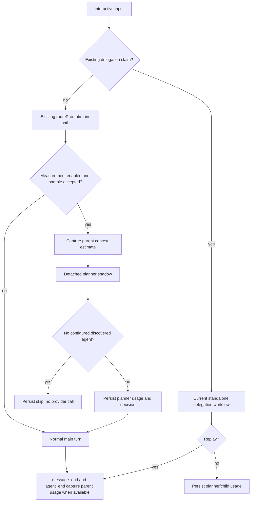

# Cache-Aware Delegation Measurement Design

## Problem

The router now has an opt-in standalone delegation path. It can measure the selected planner and delegated child once delegation is enabled, but it has no evidence for the main-session cost that a future contextual handoff would replace. Forwarding the full parent conversation before understanding provider cache behavior could increase input cost, cache misses, latency, and data exposure.

The next slice must gather that evidence without changing the current delegation contract or forwarding parent transcript content.

## Goals

- Measure the selected planner's provider-reported token, cache, and cost usage.
- Measure delegated subprocess usage when a child actually runs.
- Sample planner calls on otherwise-main-path prompts so the main-session cost can be compared with a hypothetical contextual handoff.
- Capture the parent context-token estimate and, when available, the parent assistant turn usage for each measured main-path or replayed request.
- Keep measurement opt-in, compact per record, bounded in active work, deterministic in tests, and fail-open.
- Persist only compact metadata; do not add copied conversation, planner reasoning, or generated task text to measurement records.
- Keep `/usage`, routing semantics, child execution, cancellation, and replay behavior unchanged.

## Non-goals

- Forwarding the full parent conversation to a child.
- Adding a contextual handoff or canary execution path.
- Calling a second planner when delegation already claims the input.
- Sending telemetry to a new service or changing OMP's `/usage` accounting.
- Inferring cache prices or provider behavior when the provider does not report usage.

## Configuration

Extend the existing nested delegation configuration with a measurement object:

```ts
interface RouterDelegationMeasurementConfig {
  enabled: boolean;
  sampleRate: number;
}

interface RouterDelegationConfig {
  enabled: boolean;
  plannerTimeoutMs: number;
  agents: readonly string[];
  measurement: RouterDelegationMeasurementConfig;
}
```

Defaults:

```json
{
  "delegation": {
    "enabled": false,
    "plannerTimeoutMs": 20000,
    "agents": ["scout", "sonic", "task", "designer", "reviewer", "security-reviewer"],
    "measurement": {
      "enabled": false,
      "sampleRate": 0.1
    }
  }
}
```

`enabled` must be boolean. `sampleRate` must be a finite number in the inclusive range `0..1`; invalid values retain the prior configuration-layer value. Existing configuration precedence and partial nested overrides remain unchanged. A sample rate of `0` disables all shadow calls without requiring a second flag; `1` measures every eligible main-path prompt.

`/route status` reports whether measurement is enabled and its sample rate. `/route reload` reloads these values using the existing configuration reload behavior.

## Measurement flow



### Sampled main-path shadow

The existing input handler retains ownership priority: an eligible delegation workflow is claimed before any shadow decision. A prompt is shadow-eligible only when it is interactive, idle, text-only, non-command input, and at least `classifierMinPromptChars` long. After the existing `routePrompt` completes, the shadow uses the routed model when one exists, otherwise the current model.

Sampling is evaluated with an injected random source. The implementation keeps at most one shadow planner active for a session; a second sampled prompt while one is active is recorded as skipped rather than queued. A sampled shadow starts detached from the main input path and never delays the main turn. Session shutdown and session switching abort and clear the active shadow.

The shadow performs the existing agent discovery, allowlist intersection, repository-index load, and planner call. If the intersection is empty, it records a skip without making a provider request. If planning returns `delegate: true`, the record contains only the selected agent name and task length; it does not persist the task text. The shadow never calls `runSubprocess`, `sendMessage`, or `sendUserMessage`, and never changes the selected model or thinking level.

### Existing delegated workflow

The current standalone workflow remains behaviorally identical. Its measurement record gains:

- parent context-token estimate captured before the workflow's provider calls;
- planner usage, if the planner returned provider usage;
- child usage, if a subprocess ran and returned provider usage;
- terminal outcome, elapsed time, selected model/agent, and replay status.

A planner decline, timeout, malformed response, missing agent, child failure, cancellation, or successful child result follows the existing recovery path. Measurement is attached to the corresponding state records and does not decide recovery.

### Parent turn usage

Register the public `message_end` and `agent_end` extension hooks. For a sampled main-path prompt or a delegated workflow that replays the original request, create a short-lived in-memory correlation before the main turn can begin. It first waits for a `message_end` user message whose text equals the sampled prompt or starts with the replayed original request. Only after that confirmation does it collect usage from subsequent assistant `message_end` events.

When `agent_end` arrives with `willContinue !== true`, append the aggregate assistant usage snapshot to the measured run and clear the correlation. An `agent_end` with `willContinue: true` keeps the correlation open across an automatic retry or continuation. The correlation expires after five minutes if the queued user message or terminal agent event never arrives. Session branch/tree/switch and shutdown lifecycle events clear all pending correlations so a later turn cannot be attributed to an earlier session. If no assistant usage is available, the record stores `null` and the main path continues.

This avoids correlating by the first `turn_end`: that event has no run identifier and a single logical prompt can contain tool turns, retries, and multiple assistant messages. The parent context estimate remains the authoritative size signal; the aggregated assistant usage is an observed cost signal when OMP emits it.

## Usage contract

Create pure normalization helpers around OMP's public usage shape. A normalized snapshot has nullable fields so missing provider data is explicit:

```ts
interface UsageSnapshot {
  input: number | null;
  output: number | null;
  cacheRead: number | null;
  cacheWrite: number | null;
  totalTokens: number | null;
  cost: number | null;
}
```

Planner `AssistantMessage.usage`, child `SingleResult.usage`, and parent assistant `message_end` usage all use this normalizer. A helper aggregates snapshots only when both values are known; it never treats an unknown value as zero for a field that was not reported. Provider-reported `cost.total` is copied without recomputing prices.

Measurement records use the existing state-only delegation entry type and a distinct `status: "shadow"` for shadow results. New metadata is compact and excludes request text, planner reasoning, child task text, and result output. Existing delegation records retain their current request/task fields for backwards compatibility; this slice does not widen those fields.

A shadow record includes:

- `runId`, start time, terminal outcome (`completed`, `declined`, `skipped`, `failed`, or `cancelled`);
- model identity and parent context-token estimate;
- sample rate and planner usage snapshot;
- selected agent name and task character count only when the plan delegates;
- parent usage snapshot when the corresponding `agent_end` arrives.

A delegated workflow record includes the same usage fields plus the existing agent/task/model/status data. All usage fields are nullable.

## Failure handling and safety

- Missing usage, malformed cost data, or an unavailable context estimate never fails routing or execution.
- A shadow timeout, provider error, discovery error, or index-read error is logged concisely and recorded as a shadow failure; the main prompt proceeds normally.
- A shadow abort on shutdown or session switch is recorded as cancelled and cannot attach to a later session.
- Measurement state-entry failures are caught and logged; they never replay a request or block a child.
- The planner receives the same standalone inputs already used by delegation. No parent transcript or hidden context is copied into the shadow request.
- Existing slash-command bypasses remain before routing, delegation, and shadow measurement.

## Testing

### Pure contracts

- Configuration defaults and partial nested overrides.
- Rejection of non-boolean `enabled`, non-finite rates, and rates outside `0..1`.
- Sampling boundaries at `0`, `1`, below, and above the configured rate with an injected random source.
- Usage normalization for complete, partial, and absent provider usage.
- Aggregation preserving `null` for unknown fields and summing known numeric fields.

### Extension behavior

- A sampled main-path prompt starts a shadow without delaying or changing the main route.
- A rejected sample starts no planner call.
- An empty allowlist/discovery intersection records a skip without a provider request.
- A shadow delegate decision never executes a child or sends a visible result.
- Delegated planner and child usage snapshots appear in state metadata when supplied.
- Missing usage and shadow failures are fail-open.
- `message_end`/`agent_end` attaches parent usage to the pending measured run; session switch/shutdown clears pending correlation.
- Existing successful, replay, failure, cancellation, slash-command, and `/usage` behavior remains unchanged.

### Smoke checks

- Enable measurement with a low sample rate and submit a sufficiently long ordinary prompt; verify a shadow state entry appears and the main turn still runs normally.
- Use a configuration with no discovered allowlisted agents; verify the shadow records a skip without a planner request.
- Enable standalone delegation and submit a self-contained task; verify planner/child usage metadata is recorded and the child result path is unchanged.
- Run `/usage` while measurement is enabled; verify it opens immediately without a shadow call.

## Delivery

Implement the config/parser changes, pure measurement helpers, planner usage return, extension shadow lifecycle, parent-turn correlation, focused tests, and configuration documentation in the existing `feat/subagent-dispatch` branch. Run the focused tests, full `bun test`, and `bun run check`; then smoke-test the opt-in path and push the branch to PR #4.
