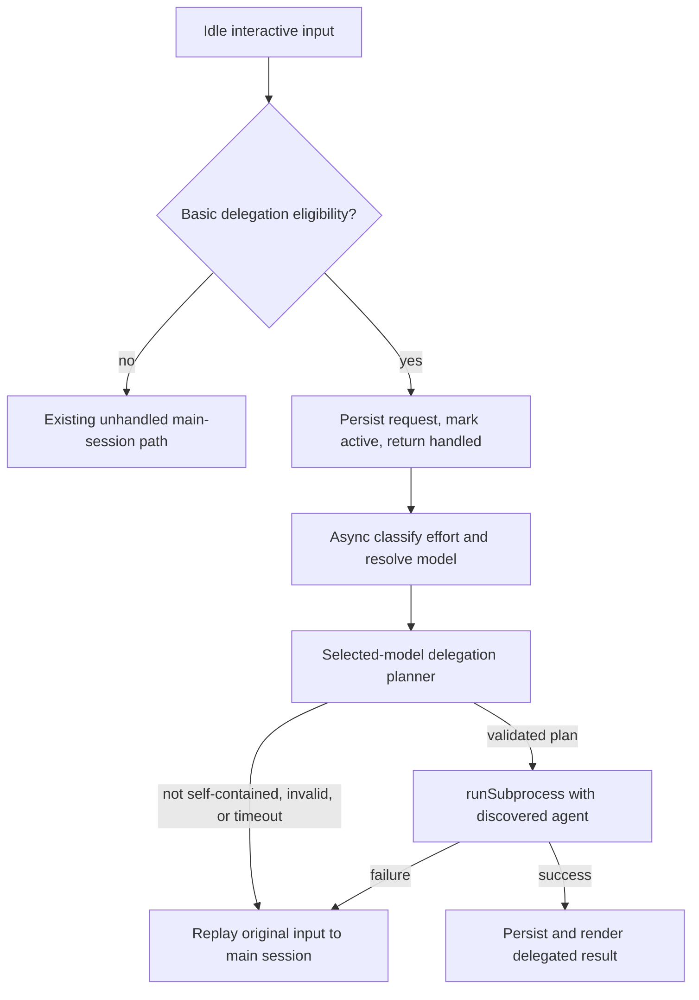

# Repository Index and Subagent Dispatch Design

## Problem

The extension chooses an effort-appropriate model but still sends every interactive prompt through the main session. That preserves conversation context but spends main-session context and output tokens on tasks a purpose-built subagent can complete independently. The repository also lacks scoped `AGENTS.md` files that explain its architecture and testing conventions to agents entering different directories.

An earlier router build could intercept slash commands before the interactive command handler. The current source already excludes every input beginning with `/`. Fresh sessions confirm `/usage` works with the extension enabled; only an already-running session with the old extension module still fails. Extension code is loaded at process start, so `/route reload` cannot repair that stale process.

## Goals

- Add concise, directory-scoped repository instructions without duplicating the README.
- Preserve the existing effort classifier and route selection policy.
- For eligible, self-contained interactive requests, let the selected effort-appropriate model produce a small delegation plan and then run the matching discovered subagent directly.
- Avoid a main-agent inference turn for successfully delegated work.
- Preserve the original request and fall back to the normal main path if planning or execution cannot proceed.
- Keep slash commands, conversational follow-ups, RPC input, ACP input, and queued follow-up input on their existing paths.
- Make delegation opt-in so upgrading the router does not silently change existing session semantics.

## Non-goals

- Replacing OMP's task tool or changing OMP itself.
- Delegating prompts that require prior conversational context.
- Intercepting non-interactive input paths that do not emit the extension `input` event.
- Making arbitrary agent files executable without discovery and allowlist validation.
- Synthesizing a second main-model answer after a successful subagent result.
- Changing `/usage`; the current slash-command bypass is correct. Restarting the stale OMP process is the operational fix.

## Repository instruction index

Add three uppercase `AGENTS.md` files. Uppercase is the OMP context-file convention; `.omp/agents/*.md` is a separate subagent-definition mechanism.

### Root `AGENTS.md`

- State the six-module architecture and the extension entry point.
- List `bun test`, `bun run check`, and focused `bun test test/<name>.test.ts` commands.
- Define public compatibility boundaries: use exported OMP APIs, keep config backward compatible, preserve versioned session state, and keep slash commands outside routing.
- Point agents to the narrower `src/AGENTS.md` and `test/AGENTS.md` rules.

### `src/AGENTS.md`

- Assign module ownership:
  - `extension.ts`: lifecycle and UI orchestration.
  - `classifier.ts`: direct `pi-ai` calls without an agent session.
  - `config.ts`: validation and layered untrusted JSON config.
  - `routing.ts`: pure route policy.
  - `state.ts`: versioned persisted state.
  - `setup.ts`: setup UI and safe config writes.
- Require pure logic to stay out of `extension.ts` when it can be tested independently.
- Permit only the public `@oh-my-pi/pi-coding-agent/task` discovery and `@oh-my-pi/pi-coding-agent/task/executor` execution imports for direct delegation.
- Require exported-symbol callsites to be checked before contract changes.

### `test/AGENTS.md`

- Map each source module to its corresponding test file.
- Require behavior-first tests for new observable contracts.
- Require the focused test during development and the full test/check commands before completion.
- Keep tests deterministic and independent of live model credentials.

No additional scoped file is warranted for `docs`: it contains user-facing explanation rather than a separate implementation subsystem.

## Delegation architecture

### Configuration

Extend `RouterConfig` with a nested delegation object to keep the new policy cohesive and leave room for compatible additions:

```ts
interface RouterDelegationConfig {
  enabled: boolean
  plannerTimeoutMs: number
  agents: readonly string[]
}

interface RouterConfig {
  // existing fields
  delegation: RouterDelegationConfig
}
```

Defaults:

```json
{
  "delegation": {
    "enabled": false,
    "plannerTimeoutMs": 20000,
    "agents": ["scout", "sonic", "task", "designer", "reviewer", "security-reviewer"]
  }
}
```

Config parsing treats JSON as untrusted input:

- `enabled` must be boolean.
- `plannerTimeoutMs` must be a positive safe integer no greater than 120,000 ms.
- `agents` must be a non-empty array of trimmed, non-empty strings.
- Invalid nested fields retain the prior layer's values.
- Later user, project, and explicit layers override individual nested fields rather than replacing the complete object.

The setup flow exposes an enable/disable choice and preserves advanced values it does not edit. `/route status` reports whether self-contained delegation is enabled. `/route reload` reloads the configuration but does not claim to reload extension source.

### Planning contract

After the existing classifier chooses an effort and the routing policy resolves a model, the extension uses that selected model for a compact planning call. The planner receives:

- The current request only, including text/image presence metadata needed to judge eligibility.
- The discovered allowlisted agent names and their descriptions.
- A short repository index derived from the closest applicable `AGENTS.md` context.
- A strict instruction to classify only requests that can be completed without prior conversation.

This selected-model planner is an intentional opt-in tradeoff: a basically eligible request that is ultimately kept on the main path still pays for one compact planning call. The router avoids that cost for short prompts, images, commands, shell/Python prefixes, disabled delegation, and any input received while another delegation workflow is active.

It returns one JSON object:

```ts
type DelegationPlan =
  | { delegate: false; reason: string }
  | { delegate: true; agent: string; task: string }
```

The parser accepts only a single object with the exact required field types. A delegated plan is valid only when:

- Delegation is enabled.
- No delegated child is already active for the session.
- The request came from idle interactive input.
- The input is non-empty and does not begin with `/`, `->`, or `=>`.
- The text meets `classifierMinPromptChars` and contains no image parts.
- The planner explicitly marks it self-contained.
- `agent` exists in both the configured allowlist and current `discoverAgents` result.
- `task` is non-empty.

Invalid, timed-out, or non-delegated plans continue through the existing main-session route using the already selected model and thinking effort.

### Execution flow



The extension uses the public `@oh-my-pi/pi-coding-agent/task` discovery API and the public `@oh-my-pi/pi-coding-agent/task/executor` `runSubprocess` export rather than constructing `TaskTool`, which requires a private/full `ToolSession`. `runSubprocess` receives:

- The discovered `AgentDefinition`.
- The planner's task.
- A stable run `id` and monotonic `index`.
- The selected route model as `modelOverride`.
- The selected thinking effort.
- The current working directory.
- `keepAlive: false`.
- A per-run `AbortController` signal.

The input handler performs only synchronous eligibility and ownership steps. For eligible input it copies the original content, appends a pending state entry, marks one delegation workflow active, starts an asynchronous classifier/planner/executor pipeline with a terminal error handler, and immediately returns `{ handled: true }`. It never awaits a provider call or child execution, so the extension handler's 30-second cap cannot release the same input into the main path.

The asynchronous pipeline first applies the existing selected main model and thinking effort. Planning races `plannerTimeoutMs` and aborts the planner signal on timeout. A malformed, timed-out, missing-agent, or non-self-contained result replays the durable original input through `sendUserMessage(..., { deliverAs: "followUp" })`; extension-originated messages bypass the idle-interactive hook, preventing a delegation loop. A valid plan starts `runSubprocess` and keeps ownership until the child settles.

Only one planning-or-child workflow may run per session. While it runs, later input follows the normal main path. Session shutdown aborts the active controller. A `/route cancel` command aborts the active workflow without disabling routing.

### Result persistence and rendering

Interactive input consumed by an extension does not enter the normal user-message history. Before returning handled, the extension uses `appendEntry` to persist workflow state containing:

- Original request text.
- Selected model and effort once known.
- Agent name and normalized task once known.
- Start time and a stable run identifier.
- Current pending, delegated, completed, failed, or cancelled status.

`appendEntry` is state-only and is not rendered or sent to the LLM. On completion, the extension uses `sendMessage` with a registered custom message renderer, `display: true`, and `triggerTurn: false`. The visible message contains the delegated request and final result, so a later main-session follow-up has the exchange in context without triggering a main-model synthesis turn at completion. Status metadata remains in the state entry rather than duplicating the full result.

Images are not silently discarded. Until the public subprocess contract can carry the original image parts, any input containing images is ineligible and remains on the main path.

### Failure recovery

Failure must preserve the user's request:

- Classifier/planner timeout, malformed output, missing agent, or non-self-contained classification: mark the workflow failed or passed through, clear ownership, and replay the original input with `sendUserMessage(..., { deliverAs: "followUp" })`.
- Child startup or execution failure: persist and render the failure, then replay a guarded follow-up containing the original request plus a warning that the child may have produced side effects and current state must be inspected before repeating work.
- Explicit `/route cancel` or session-shutdown abort at any planning or execution phase: append a cancelled state and do not replay automatically.
- Every replay clears workflow ownership first. Extension-originated messages do not re-enter the idle-interactive delegation hook, preventing a loop.

The extension logs concise diagnostics but never includes credentials or the full model request payload.

## Compatibility constraints

- Current default behavior is unchanged because delegation defaults off.
- Existing flat config fields and config precedence remain unchanged.
- State changes, if needed, use a new explicit version and migration rather than mutating the current serialized shape implicitly.
- Every slash command bypasses routing and delegation before any classifier/planner call.
- Interactive Enter is the only delegated ingress. RPC, ACP, `sendUserMessage`, and queued follow-ups retain their existing behavior.
- Discovered agent descriptions are prompt input, not authority. The configured allowlist is the enforcement boundary.

## Verification

### Automated contracts

- Config tests: defaults, partial nested overrides, invalid values, timeout bounds, and layer merging.
- Planner parser tests: valid delegated/non-delegated plans, malformed JSON, extra/wrong fields, unknown agents, and blank tasks.
- Eligibility tests: slash commands, shell prefixes, short prompts, images, disabled config, active workflow, and non-interactive sources.
- Lifecycle tests: immediate handled return, successful result persistence/context visibility, timeout replay, startup/execution failure guarded replay, cancellation without replay, and no second main turn after success.
- Existing classifier, route, state, setup, and extension tests remain green.

### Smoke checks

- Start OMP with delegation enabled and submit a self-contained repository task: verify the selected planner model dispatches the appropriate agent and the main model does not run.
- Submit a conversational follow-up: verify it stays in the main session.
- Run `/usage`: verify it opens immediately and does not invoke classifier, planner, or child.
- Start a delegated task and run `/route cancel`: verify the child stops and the request is not replayed.
- Force a planner timeout: verify the original prompt follows the normal main route.

## Delivery

The implementation lands the three `AGENTS.md` files, config/parser/setup/status changes, planner and executor integration, tests, and README configuration/behavior notes in one branch. The stale-process `/usage` symptom receives no source change beyond preserving and testing the existing slash-command bypass; users must restart OMP after updating extension code.
